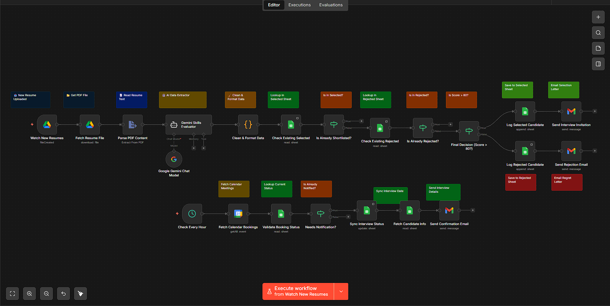
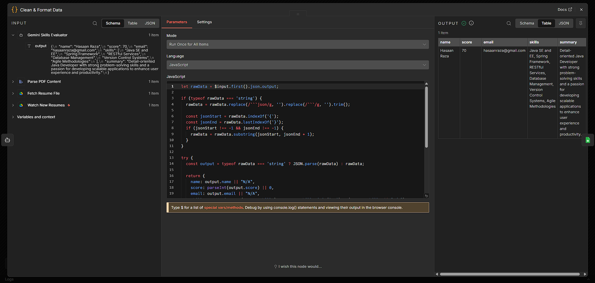
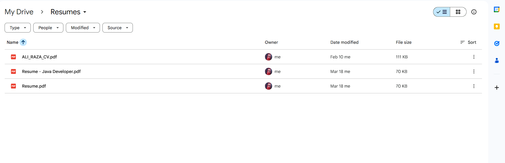
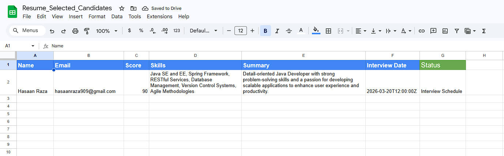
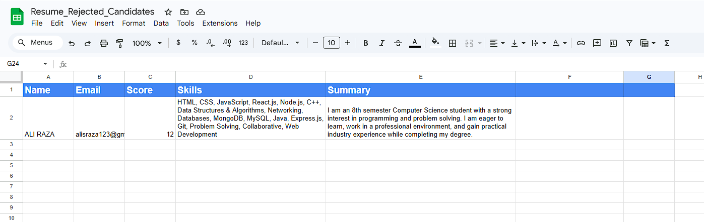
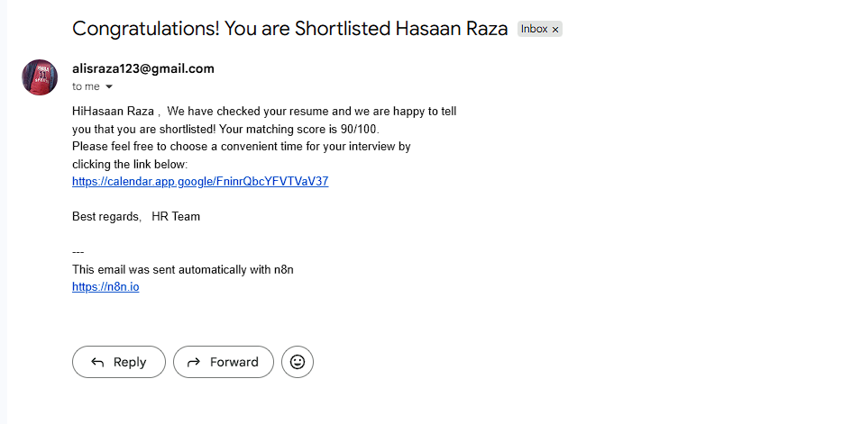
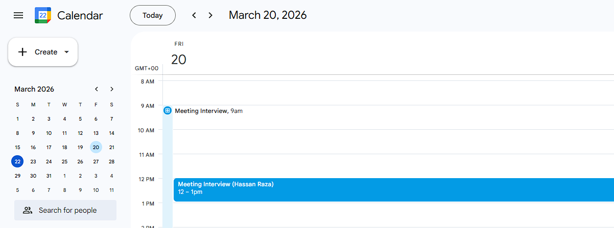

# 🚀 Resume Screening System using n8n

## 📌 Overview

This project is an **AI-powered Resume Screening System** built using n8n that automates the entire hiring workflow. It processes incoming CVs, evaluates candidates based on predefined criteria, and manages communication without manual effort.

---

## ⚙️ How It Works

1. 📥 A new resume (CV) is uploaded to Google Drive
2. 📄 The system automatically extracts text from the file
3. 🤖 AI analyzes the resume based on required skills and criteria
4. 🎯 A score is generated for each candidate
5. ✅ If score > 80 → Candidate is **Qualified**
6. ❌ Otherwise → Candidate is **Disqualified**

---

## 🧠 Features

* AI-based resume analysis and scoring
* Automated candidate shortlisting
* Custom skill-based evaluation criteria
* Fully automated workflow using n8n
* Real-time processing of new CV uploads

---

## 🔄 Automation Flow

### ✅ Qualified Candidates:

* Stored in Google Sheets (Qualified List)
* Receive email: **Shortlisted for Interview**
* Get Google Calendar link to book interview slot
* Receive confirmation email after booking

### ❌ Disqualified Candidates:

* Stored in a separate Google Sheet
* Receive email: **Not selected based on criteria**

---

## 🛠️ Tech Stack

* n8n (Workflow Automation)
* Google Drive API
* Google Sheets API
* Gmail API
* AI Model (Gemini / OpenAI)

---

## 📂 Project Structure

* `workflow.json` → Exported n8n workflow
* `screenshots/` → Workflow and output images

---

## 📸 Screenshots

### 🔹 Complete Workflow Overview

### 🔹 AI Resume Evaluation Node

### 🔹 Google Drive (Resume Upload Source)

### 🔹 Qualified Candidates (Google Sheet)

### 🔹 Rejected Candidates (Google Sheet)

### 🔹 Email Notification (Candidate Communication)

### 🔹 Interview Scheduling (Google Calendar)

---

## 💡 Use Cases

* HR automation
* Recruitment agencies
* Startup hiring pipelines
* Bulk resume filtering

---

## 🚀 Future Improvements

You **can try**:

- 📊 Add a dashboard to see candidate scores  
- 📝 Collect interview feedback via Google Forms/Sheets  
- 🔗 Connect workflow with an ATS system  
---

## 👨‍💻 Author

**Ali Raza**

---

## ⭐ Support

If you found this project useful, consider giving it a ⭐ on GitHub!
